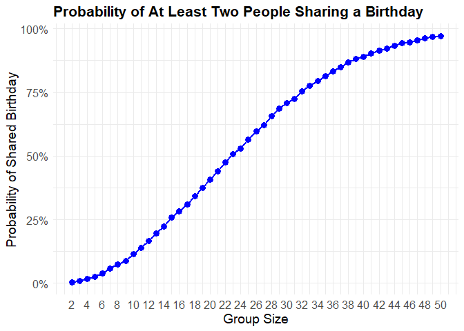
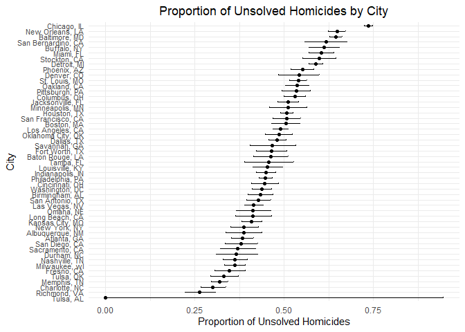

p8105_hw5_xl3495
================
Xueting Li
2024-11-09

# Problem 1

Birthday generator function

``` r
birthday_draw = function(n) {
  random_birthdays = sample(1:365, n, replace = TRUE)
  
  duplicates = duplicated(random_birthdays)
  
  result =  any(duplicates)
  
  return(result)
}
```

Simulations

``` r
simulation = function(group_size, trials = 10000){
  p = map_dbl(group_size, function(n){
    
    results = replicate(trials, birthday_draw(n))
    
    return(mean(results))
  })
  
  return(p)
}

probs = simulation(2:50)

probs
```

    ##  [1] 0.0033 0.0079 0.0158 0.0248 0.0387 0.0570 0.0749 0.0885 0.1160 0.1402
    ## [11] 0.1665 0.1958 0.2228 0.2578 0.2824 0.3105 0.3434 0.3750 0.4079 0.4388
    ## [21] 0.4747 0.5067 0.5301 0.5644 0.5958 0.6226 0.6564 0.6871 0.7088 0.7246
    ## [31] 0.7537 0.7753 0.7959 0.8147 0.8331 0.8494 0.8693 0.8803 0.8905 0.9040
    ## [41] 0.9146 0.9216 0.9335 0.9434 0.9471 0.9537 0.9627 0.9669 0.9710

``` r
df = data.frame(
  group_size = 2:50,
  probability = probs
)

ggplot(df, aes(x = group_size, y = probability)) +
  geom_point(color = "blue", size = 3) +
  geom_line(color = "blue", lwd = 1) +   
  labs(
    title = "Probability of At Least Two People Sharing a Birthday",
    x = "Group Size",
    y = "Probability of Shared Birthday"
  ) +
  theme_minimal() +
  theme(
    plot.title = element_text(size = 16, face = "bold"),
    plot.subtitle = element_text(size = 12),
    axis.title = element_text(size = 14),
    axis.text = element_text(size = 12)
  ) +
  scale_x_continuous(breaks = seq(2, 50, by = 2)) +  # Customize x-axis labels
  scale_y_continuous(labels = scales::percent) 
```

<!-- -->

It turns out that as the group size goes larger and larger, the
probability of at least two people sharing a birthday converges to 1. In
other words, it is very likely to (almost must) have two people with the
same birthday when randomly select over 50 people.

# Problem 2

``` r
n = 30
sigma = 5
alpha= 0.05
num_datasets = 5000

simulation_norm = function(mu){
  x = rnorm(n, mean = mu, sd = sigma)
  
  t_test = t.test(x, mu = 0) |>
    broom::tidy()

  #my column 'estimate' saves values of mu_hat
  tibble(mu = mu, estimate = t_test$estimate, p_value = t_test$p.value)
}

mu_values = c(0, 1, 2, 3, 4, 5, 6)

simulation_2 = lapply(mu_values, function(mu) {
  replicate(num_datasets, simulation_norm(mu), simplify = FALSE) |>
    bind_rows()
})


simulation_results_df = bind_rows(simulation_2)

proportion_results = simulation_results_df |>
  group_by(mu) |>
  summarise(power = mean(p_value < alpha))

ggplot(proportion_results, aes(x = mu, y = power)) +
  geom_line() +
  geom_point() +
  labs(title = "Power of One-Sample t-Test for Different μ",
       x = "True Population Mean (μ)",
       y = "Power (Proportion of Null Rejected)") +
  theme_minimal() +
  theme(plot.title = element_text(hjust = 0.5))
```

<!-- -->

From the plot, it shows the larger the effect size is, the larger the
corresponding power.

``` r
avg_estimate = simulation_results_df |>
  group_by(mu) |>
  summarise(avg_estimate = mean(estimate)) |>
  mutate(group = "All Samples")

avg_estimate_rejected = simulation_results_df |>
  filter(p_value < alpha) |>
  group_by(mu) |>
  summarise(avg_estimate_rejected = mean(estimate)) |>
  mutate(group = "Rejected Null Hypothesis")

combined_df = bind_rows(
  avg_estimate |> select(mu, avg_estimate = avg_estimate, group),
  avg_estimate_rejected |> select(mu, avg_estimate = avg_estimate_rejected, group)
)

ggplot(combined_df, aes(x = mu, y = avg_estimate, color = group, linetype = group)) +
  geom_line(size = 1.2) +
  geom_point(size = 3) +
  labs(title = "Average of Estimate Mean vs. True Mean", 
       x = "True Population Mean (μ)", 
       y = "Average of Estimate Mean") +
  theme_minimal() +
  theme(plot.title = element_text(hjust = 0.5))
```

    ## Warning: Using `size` aesthetic for lines was deprecated in ggplot2 3.4.0.
    ## ℹ Please use `linewidth` instead.
    ## This warning is displayed once every 8 hours.
    ## Call `lifecycle::last_lifecycle_warnings()` to see where this warning was
    ## generated.

<!-- -->

The sample averages of \`$\hat{\mu}$ across tests for which the null
hypothesis is rejected are not approximately equal to the true values of
population mean $\mu$, and this discrepancy arises due to the selection
bias introduced when only considering the samples where the null
hypothesis is rejected. Because of this selection for extreme values,
the average of the estimate will overestimate the true values.

# Problem 3

``` r
homicide_df = read_csv("dataset/homicide-data.csv")
```

    ## Rows: 52179 Columns: 12
    ## ── Column specification ────────────────────────────────────────────────────────
    ## Delimiter: ","
    ## chr (9): uid, victim_last, victim_first, victim_race, victim_age, victim_sex...
    ## dbl (3): reported_date, lat, lon
    ## 
    ## ℹ Use `spec()` to retrieve the full column specification for this data.
    ## ℹ Specify the column types or set `show_col_types = FALSE` to quiet this message.

``` r
head(homicide_df)
```

    ## # A tibble: 6 × 12
    ##   uid   reported_date victim_last victim_first victim_race victim_age victim_sex
    ##   <chr>         <dbl> <chr>       <chr>        <chr>       <chr>      <chr>     
    ## 1 Alb-…      20100504 GARCIA      JUAN         Hispanic    78         Male      
    ## 2 Alb-…      20100216 MONTOYA     CAMERON      Hispanic    17         Male      
    ## 3 Alb-…      20100601 SATTERFIELD VIVIANA      White       15         Female    
    ## 4 Alb-…      20100101 MENDIOLA    CARLOS       Hispanic    32         Male      
    ## 5 Alb-…      20100102 MULA        VIVIAN       White       72         Female    
    ## 6 Alb-…      20100126 BOOK        GERALDINE    White       91         Female    
    ## # ℹ 5 more variables: city <chr>, state <chr>, lat <dbl>, lon <dbl>,
    ## #   disposition <chr>

This raw dataset contains 52179 observations and 12 variables. Each
observation describes a homicide with its reported date, victim’s
information (name, race, age, sex), location (city, state, latitude,
longitude), and disposition.

``` r
homicide_summary = homicide_df |>
  mutate(city_state = paste(city, state, sep = ", ")) |>
  group_by(city_state) |>
  summarise(
    total_homicides = n(),
    unsolved_homicides = sum(disposition %in% c("Closed without arrest", "Open/No arrest"), na.rm = TRUE)
  )
```

``` r
baltimore_summary = homicide_summary |>
  filter(city_state == "Baltimore, MD")

baltimore_prop_test = prop.test(baltimore_summary$unsolved_homicides, baltimore_summary$total_homicides) |>
  broom::tidy()

baltimore_prop_test |>
  select(estimate, conf.low, conf.high) |>
  knitr::kable(digits = 3)
```

| estimate | conf.low | conf.high |
|---------:|---------:|----------:|
|    0.646 |    0.628 |     0.663 |

``` r
all_city_prop_results = homicide_summary |>
  mutate(
    prop_test = map2(unsolved_homicides, total_homicides, ~ prop.test(.x, .y)),
    tidy_results = map(prop_test, broom::tidy)
  ) |>
  select(city_state, tidy_results) |>
  unnest(tidy_results) |>
  select(city_state, estimate, conf.low, conf.high)
```

    ## Warning: There was 1 warning in `mutate()`.
    ## ℹ In argument: `prop_test = map2(unsolved_homicides, total_homicides,
    ##   ~prop.test(.x, .y))`.
    ## Caused by warning in `prop.test()`:
    ## ! Chi-squared approximation may be incorrect

``` r
all_city_prop_results |>
  knitr::kable(digits = 3)
```

| city_state         | estimate | conf.low | conf.high |
|:-------------------|---------:|---------:|----------:|
| Albuquerque, NM    |    0.386 |    0.337 |     0.438 |
| Atlanta, GA        |    0.383 |    0.353 |     0.415 |
| Baltimore, MD      |    0.646 |    0.628 |     0.663 |
| Baton Rouge, LA    |    0.462 |    0.414 |     0.511 |
| Birmingham, AL     |    0.434 |    0.399 |     0.469 |
| Boston, MA         |    0.505 |    0.465 |     0.545 |
| Buffalo, NY        |    0.612 |    0.569 |     0.654 |
| Charlotte, NC      |    0.300 |    0.266 |     0.336 |
| Chicago, IL        |    0.736 |    0.724 |     0.747 |
| Cincinnati, OH     |    0.445 |    0.408 |     0.483 |
| Columbus, OH       |    0.530 |    0.500 |     0.560 |
| Dallas, TX         |    0.481 |    0.456 |     0.506 |
| Denver, CO         |    0.542 |    0.485 |     0.598 |
| Detroit, MI        |    0.588 |    0.569 |     0.608 |
| Durham, NC         |    0.366 |    0.310 |     0.426 |
| Fort Worth, TX     |    0.464 |    0.422 |     0.507 |
| Fresno, CA         |    0.347 |    0.305 |     0.391 |
| Houston, TX        |    0.507 |    0.489 |     0.526 |
| Indianapolis, IN   |    0.449 |    0.422 |     0.477 |
| Jacksonville, FL   |    0.511 |    0.482 |     0.540 |
| Kansas City, MO    |    0.408 |    0.380 |     0.437 |
| Las Vegas, NV      |    0.414 |    0.388 |     0.441 |
| Long Beach, CA     |    0.413 |    0.363 |     0.464 |
| Los Angeles, CA    |    0.490 |    0.469 |     0.511 |
| Louisville, KY     |    0.453 |    0.412 |     0.495 |
| Memphis, TN        |    0.319 |    0.296 |     0.343 |
| Miami, FL          |    0.605 |    0.569 |     0.640 |
| Milwaukee, wI      |    0.361 |    0.333 |     0.391 |
| Minneapolis, MN    |    0.511 |    0.459 |     0.563 |
| Nashville, TN      |    0.362 |    0.329 |     0.398 |
| New Orleans, LA    |    0.649 |    0.623 |     0.673 |
| New York, NY       |    0.388 |    0.349 |     0.427 |
| Oakland, CA        |    0.536 |    0.504 |     0.569 |
| Oklahoma City, OK  |    0.485 |    0.447 |     0.524 |
| Omaha, NE          |    0.413 |    0.365 |     0.463 |
| Philadelphia, PA   |    0.448 |    0.430 |     0.466 |
| Phoenix, AZ        |    0.551 |    0.518 |     0.584 |
| Pittsburgh, PA     |    0.534 |    0.494 |     0.573 |
| Richmond, VA       |    0.263 |    0.223 |     0.308 |
| Sacramento, CA     |    0.370 |    0.321 |     0.421 |
| San Antonio, TX    |    0.429 |    0.395 |     0.463 |
| San Bernardino, CA |    0.618 |    0.558 |     0.675 |
| San Diego, CA      |    0.380 |    0.335 |     0.426 |
| San Francisco, CA  |    0.507 |    0.468 |     0.545 |
| Savannah, GA       |    0.467 |    0.404 |     0.532 |
| St. Louis, MO      |    0.540 |    0.515 |     0.564 |
| Stockton, CA       |    0.599 |    0.552 |     0.645 |
| Tampa, FL          |    0.457 |    0.388 |     0.527 |
| Tulsa, AL          |    0.000 |    0.000 |     0.945 |
| Tulsa, OK          |    0.331 |    0.293 |     0.371 |
| Washington, DC     |    0.438 |    0.411 |     0.465 |

``` r
ggplot(all_city_prop_results, aes(x = reorder(city_state, estimate), y = estimate)) +
  geom_point() +
  geom_errorbar(aes(ymin = conf.low, ymax = conf.high), width = 0.2) +
  labs(
    title = "Proportion of Unsolved Homicides by City",
    x = "City",
    y = "Proportion of Unsolved Homicides"
  ) +
  coord_flip() +
  theme_minimal() +
  theme(axis.text.y = element_text(size = 8)) +
  theme(plot.title = element_text(hjust = 0.5))
```

<!-- -->
