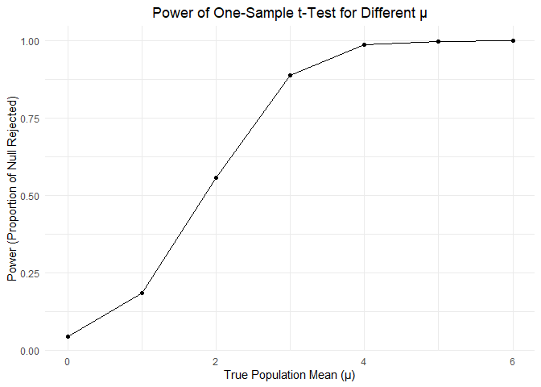

p8105_hw5_xl3495
================
Xueting Li
2024-11-09

``` r
library(tidyverse)
```

    ## ── Attaching core tidyverse packages ──────────────────────── tidyverse 2.0.0 ──
    ## ✔ dplyr     1.1.4     ✔ readr     2.1.5
    ## ✔ forcats   1.0.0     ✔ stringr   1.5.1
    ## ✔ ggplot2   3.5.1     ✔ tibble    3.2.1
    ## ✔ lubridate 1.9.3     ✔ tidyr     1.3.1
    ## ✔ purrr     1.0.2     
    ## ── Conflicts ────────────────────────────────────────── tidyverse_conflicts() ──
    ## ✖ dplyr::filter() masks stats::filter()
    ## ✖ dplyr::lag()    masks stats::lag()
    ## ℹ Use the conflicted package (<http://conflicted.r-lib.org/>) to force all conflicts to become errors

``` r
library(rvest)
```

    ## 
    ## Attaching package: 'rvest'
    ## 
    ## The following object is masked from 'package:readr':
    ## 
    ##     guess_encoding

# Problem 1

Birthday generator function

``` r
birthday_draw = function(n) {
  random_birthdays = sample(1:365, n, replace = TRUE)
  
  duplicates = duplicated(random_birthdays)
  
  result =  any(duplicates)
  
  return(result)
}
```

Simulations

``` r
simulation = function(group_size, trials = 10000){
  p = map_dbl(group_size, function(n){
    
    results = replicate(trials, birthday_draw(n))
    
    return(mean(results))
  })
  
  return(p)
}

probs = simulation(2:50)

probs
```

    ##  [1] 0.0029 0.0081 0.0138 0.0249 0.0387 0.0644 0.0792 0.0993 0.1162 0.1446
    ## [11] 0.1668 0.1884 0.2168 0.2543 0.2857 0.3158 0.3528 0.3787 0.4010 0.4473
    ## [21] 0.4731 0.5047 0.5454 0.5731 0.5927 0.6221 0.6595 0.6896 0.7088 0.7365
    ## [31] 0.7502 0.7824 0.7923 0.8146 0.8340 0.8510 0.8604 0.8786 0.8934 0.9000
    ## [41] 0.9153 0.9243 0.9330 0.9432 0.9473 0.9570 0.9593 0.9638 0.9704

``` r
df = data.frame(
  group_size = 2:50,
  probability = probs
)

ggplot(df, aes(x = group_size, y = probability)) +
  geom_point(color = "blue", size = 3) +
  geom_line(color = "blue", lwd = 1) +   
  labs(
    title = "Probability of At Least Two People Sharing a Birthday",
    x = "Group Size",
    y = "Probability of Shared Birthday"
  ) +
  theme_minimal() +
  theme(
    plot.title = element_text(size = 16, face = "bold"),
    plot.subtitle = element_text(size = 12),
    axis.title = element_text(size = 14),
    axis.text = element_text(size = 12)
  ) +
  scale_x_continuous(breaks = seq(2, 50, by = 2)) +  # Customize x-axis labels
  scale_y_continuous(labels = scales::percent) 
```

<!-- -->

It turns out that as the group size goes larger and larger, the
probability of at least two people sharing a birthday converges to 1. In
other words, it is very likely to (almost must) have two people with the
same birthday when randomly select over 50 people.

# Problem 2

``` r
n = 30
sigma = 5
alpha= 0.05
num_datasets = 5000

simulation_norm = function(mu){
  x = rnorm(n, mean = mu, sd = sigma)
  
  t_test = t.test(x, mu = 0) |>
    broom::tidy()

  #my column 'estimate' saves values of mu_hat
  tibble(mu = mu, estimate = t_test$estimate, p_value = t_test$p.value)
}

mu_values = c(0, 1, 2, 3, 4, 5, 6)

simulation_2 = lapply(mu_values, function(mu) {
  replicate(num_datasets, simulation_norm(mu), simplify = FALSE) |>
    bind_rows()
})

simulation_results_df = bind_rows(simulation_2)

proportion_results = simulation_results_df |>
  group_by(mu) |>
  summarise(power = mean(p_value < alpha))

ggplot(proportion_results, aes(x = mu, y = power)) +
  geom_line() +
  geom_point() +
  labs(title = "Power of One-Sample t-Test for Different μ",
       x = "True Population Mean (μ)",
       y = "Power (Proportion of Null Rejected)") +
  theme_minimal() +
  theme(plot.title = element_text(hjust = 0.5))
```

<!-- -->

From the plot, it shows the larger the effect size is, the larger the
corresponding power.

``` r
avg_estimate = simulation_results_df |>
  group_by(mu) |>
  summarise(avg_estimate = mean(estimate)) |>
  mutate(group = "All Samples")

avg_estimate_rejected = simulation_results_df |>
  filter(p_value < alpha) |>
  group_by(mu) |>
  summarise(avg_estimate_rejected = mean(estimate)) |>
  mutate(group = "Rejected Null Hypothesis")

combined_df = bind_rows(
  avg_estimate |> select(mu, avg_estimate = avg_estimate, group),
  avg_estimate_rejected |> select(mu, avg_estimate = avg_estimate_rejected, group)
)

ggplot(combined_df, aes(x = mu, y = avg_estimate, color = group, linetype = group)) +
  geom_line(size = 1.2) +
  geom_point(size = 3) +
  labs(title = "Average of Estimate Mean vs. True Mean", 
       x = "True Population Mean (μ)", 
       y = "Average of Estimate Mean") +
  theme_minimal() +
  theme(plot.title = element_text(hjust = 0.5))
```

    ## Warning: Using `size` aesthetic for lines was deprecated in ggplot2 3.4.0.
    ## ℹ Please use `linewidth` instead.
    ## This warning is displayed once every 8 hours.
    ## Call `lifecycle::last_lifecycle_warnings()` to see where this warning was
    ## generated.

<!-- -->

The sample averages of $\hat{\mu}$ across tests for which the null
hypothesis is rejected are not approximately equal to the true values of
population mean $\mu$, and this discrepancy arises due to the selection
bias introduced when only considering the samples where the null
hypothesis is rejected. Because of this selection for extreme values,
the average of the estimate will overestimate the true values.
